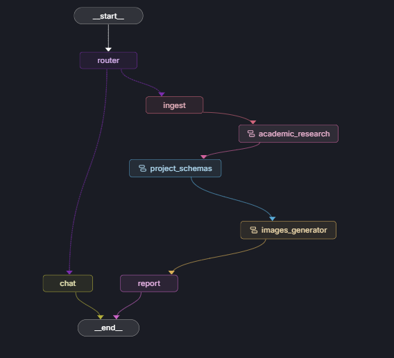

# Informe de Actividades - Proyecto de Vigilancia Tecnológica
## Servidor LangGraph `ctm_agent`
**Periodo:** Octubre 2024

---

### 1. Introducción

Este documento presenta el funcionamiento del servidor `ctm_agent`, diseñado para actuar como un asistente inteligente en la formulación de proyectos de vigilancia tecnológica. El sistema automatiza la creación de informes complejos, pasando de una idea general a un documento estructurado con rigor académico y metodológico.

Este informe pretende explicar el estado del desarrollo actual del agente `ctm_agent`, el ppanteamiento de la logica aseguir y sus componenets principales.  

### 2. Flujo de Generación del Reporte

El valor principal del sistema reside en su capacidad para encadenar diferentes etapas de trabajo, simulando cómo un equipo humano abordaría la formulación de un proyecto.

A continuación, se describe el proceso paso a paso:

#### Paso 1: Entendimiento de la Solicitud (Ingesta)
Todo comienza cuando el usuario describe su idea y una convocatoria asociada (ej. *"Quiero un proyecto sobre IA en la agricultura"*).
*   **Lo que hace el sistema:** Analiza el texto para extraer los datos clave: **Título del Proyecto**, **Descripción** y **Palabras Clave**.
*   **Resultado:** El agente "entiende" de qué trata el proyecto y prepara una carpeta virtual (el estado) donde irá guardando toda la información que genere.

#### Paso 2: Investigación Académica
Antes de escribir, el sistema necesita informarse.
*   **Lo que hace el sistema:** Un agente especializado busca información en fuentes científicas reales (como ArXiv o PubMed) y en la web.
*   **Resultado:** Genera un **Marco Teórico** sólido y una lista de **Referencias Bibliográficas** en formato APA. Esto asegura que el proyecto tenga sustento científico y no sea una "alucinación" de la IA.

#### Paso 3: Estructuración Metodológica (El "Cerebro" del Proyecto)
Con la información teórica lista, el sistema pasa a definir la estructura del proyecto. Este proceso es secuencial y lógico:
1.  **Justificación:** Redacta por qué es importante el proyecto.
2.  **Objetivos:** Define un objetivo general y objetivos específicos medibles (SMART).
3.  **Metodología:** Propone cómo se va a ejecutar el trabajo.
4.  **Cronograma:** Crea una tabla de actividades estimada.
5.  **Riesgos:** Identifica posibles problemas y cómo mitigarlos.
6.  **Impactos:** Proyecta los beneficios sociales, económicos y tecnológicos.
7.  **Resumen Ejecutivo:** Sintetiza todo lo anterior en una visión general.

#### Paso 4: Generación Visual
Para que el reporte sea más atractivo, el sistema crea sus propias ilustraciones.
*   **Lo que hace el sistema:** Lee el título y la descripción del proyecto, imagina una portada adecuada y crea un "prompt" (instrucción) para un modelo de generación de imágenes.
*   **Resultado:** Una imagen única y alusiva al tema del proyecto que se inserta en el reporte final.

#### Paso 5: Ensamble del Reporte Final
Finalmente, el sistema toma todas las piezas generadas en los pasos anteriores (teoría, metodología, imagen, cronograma) y las une en un solo documento bien formateado.

---

### 3. Componentes Clave (Resumen No Técnico)

Para lograr este flujo, el sistema utiliza varios "expertos" virtuales:

*   **El Coordinador (Router):** Es quien recibe al usuario y decide si quiere conversar o empezar un proyecto nuevo.
*   **El Investigador (Academic Agent):** Es el encargado de buscar en internet y leer papers. Tiene herramientas para acceder a bases de datos científicas.
*   **El Planificador (Project Schema):** Es quien sabe de metodología de proyectos. No busca en internet, sino que piensa y estructura la información lógica.
*   **El Artista (Image Generator):** Se encarga exclusivamente de la parte visual.

### 4. Tecnologías Implementadas

El sistema se construye sobre un stack tecnológico moderno y robusto:

*   **LangGraph:** Framework de orquestación para definir el flujo de control y el estado de los agentes.
*   **Google Gemini 2.5 Flash:** Modelo de lenguaje principal (LLM) utilizado para razonamiento, generación de texto y estructuración de datos.
*   **Tavily AI:** Motor de búsqueda optimizado para agentes de IA, utilizado para la recuperación de información en tiempo real.
*   **LangChain:** Biblioteca base para la interacción con modelos y herramientas.
*   **Python 3.11+:** Lenguaje de programación base.

### 5. Estado Actual y Logros de Octubre

Durante este mes, logramos que todos estos "expertos" trabajen en equipo de forma autónoma.
*   Se completó la conexión entre la investigación y la planificación: ahora la metodología se basa en lo que investigó el agente académico.
*   Se integró la generación de imágenes automática.
*   El sistema es capaz de entregar un reporte completo en formato Markdown listo para ser leído.

---

### 6. Próximos Pasos

*   Mejorar la capacidad de investuiagcion y redacciond el marco terocio por parte del agente académico.  
*   Mejora de los propmts utilizados para la genracion de la secciones dle documento final.
*   Mejorar el formato del reporte final ya que actualemnete no cumple con los estandares esperados. 
*   a parte de la genberacio del documento final generar una presentacion segun las directrices sujeridas enla ultima reunion. 
