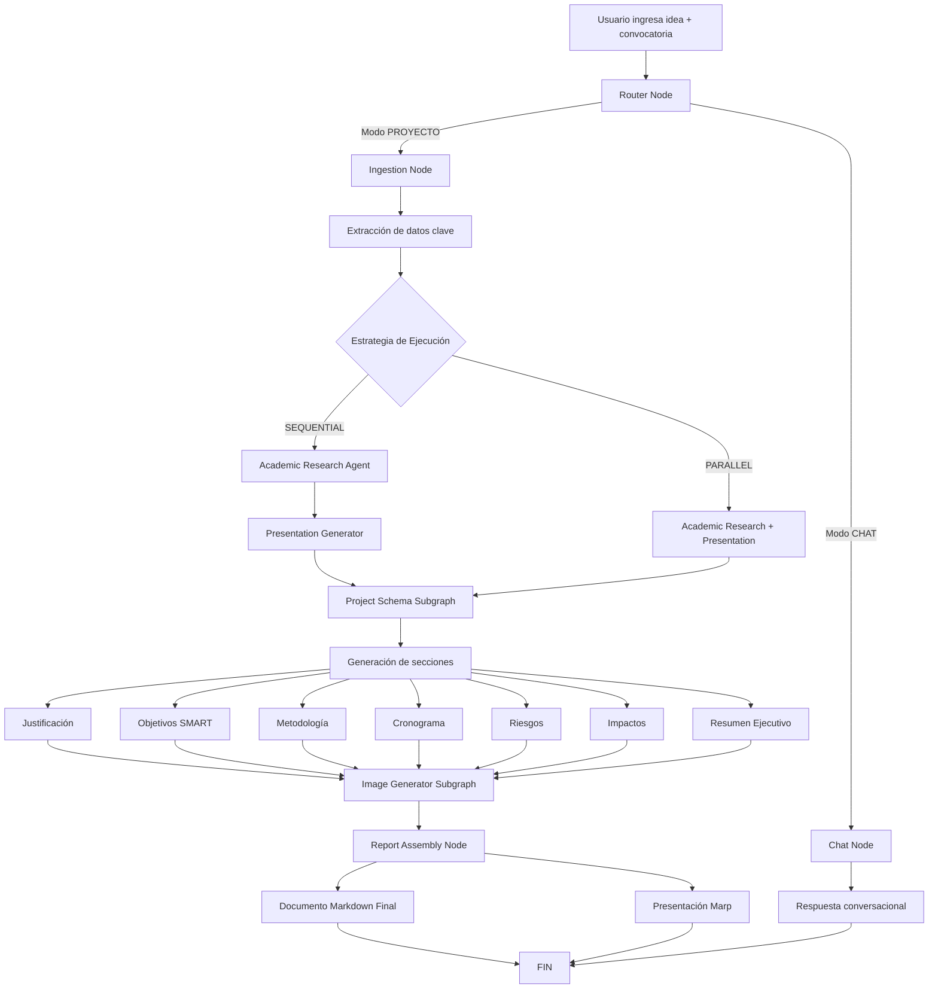

# Vigilancia Tecnológica

| Organismo | COTECMAR |
|-----------|----------|
| **Proyecto** | Vigilancia Tecnológica |
| **Entregable** | Entregable N°1 - Documento de Requerimientos del Sistema |
| **Autor** | Carlos Daniel Agamez Palomino |
| **Versión / Edición** | 001 | **Fecha de Versión** | Septiembre 2025 |

---

## Contenido

1. [Introducción](#1-introducción)
2. [Descripción del Proyecto](#2-descripción-del-proyecto)
3. [Objetivos del Sistema](#3-objetivos-del-sistema)
4. [Requerimientos del Sistema](#4-requerimientos-del-sistema)
5. [Arquitectura del Sistema](#5-arquitectura-del-sistema)
6. [Tecnologías Implementadas](#6-tecnologías-implementadas)
7. [Servicios Externos e Integraciones](#7-servicios-externos-e-integraciones)
8. [Flujo de Generación de Documentos](#8-flujo-de-generación-de-documentos)

---

## 1. Introducción

El presente documento constituye el **Entregable N°1** del proyecto de **Vigilancia Tecnológica**, correspondiente al periodo de **Septiembre 2025**. Este entregable tiene como propósito documentar los requerimientos del sistema, la arquitectura implementada, las tecnologías utilizadas y los servicios externos integrados en el desarrollo del **Agente de Generación de Documentos y Propuestas de Proyectos** para aplicar a convocatorias de financiamiento.

El sistema desarrollado representa una solución innovadora basada en inteligencia artificial que automatiza el proceso de formulación de proyectos, transformando ideas generales en documentos estructurados con rigor académico y metodológico, listos para ser presentados en convocatorias de financiamiento científico y tecnológico.

---

## 2. Descripción del Proyecto

### 2.1 Visión General

El proyecto **Vigilancia Tecnológica** consiste en el desarrollo de un **agente inteligente de generación automática de documentos y propuestas de proyectos** diseñado para asistir a investigadores, instituciones académicas y organizaciones en la formulación de propuestas competitivas para convocatorias de financiamiento.

### 2.2 Componentes Principales

El sistema se compone de dos elementos fundamentales:

1. **LangGraph Agent (Backend)**: Motor de inteligencia artificial que maneja toda la lógica del agente, incluyendo:
   - Procesamiento de lenguaje natural
   - Investigación académica automatizada
   - Generación de contenido estructurado
   - Orquestación de flujos de trabajo complejos

2. **Chainlit Interface (Frontend)**: Interfaz de usuario conversacional que permite:
   - Interacción natural con el agente
   - Visualización del progreso en tiempo real
   - Descarga de documentos generados
   - Gestión de sesiones de trabajo

### 2.3 Propuesta de Valor

El sistema automatiza tareas que tradicionalmente requieren días o semanas de trabajo especializado:

- **Investigación bibliográfica**: Búsqueda y análisis de literatura científica relevante
- **Redacción metodológica**: Estructuración de objetivos, metodología y cronogramas
- **Generación de contenido visual**: Creación de portadas e ilustraciones personalizadas
- **Formateo profesional**: Documentos listos para presentación en formato Markdown y presentaciones Marp

---

## 3. Objetivos del Sistema

### 3.1 Objetivo General

Desarrollar un sistema inteligente basado en agentes de IA que automatice la generación de propuestas de proyectos de investigación y desarrollo tecnológico, cumpliendo con los estándares académicos y metodológicos requeridos por convocatorias de financiamiento.

### 3.2 Objetivos Específicos

1. **Automatizar la investigación académica**: Implementar capacidades de búsqueda y síntesis de información científica desde múltiples fuentes especializadas.

2. **Estructurar propuestas metodológicas**: Generar automáticamente secciones clave como justificación, objetivos SMART, metodología, cronogramas, análisis de riesgos e impactos.

3. **Integrar generación multimodal**: Combinar texto, imágenes y presentaciones en un flujo de trabajo coherente.

4. **Garantizar trazabilidad y calidad**: Implementar monitoreo con LangSmith y validación de contenido generado.

5. **Facilitar la interacción usuario-agente**: Proporcionar una interfaz conversacional intuitiva mediante Chainlit.

---

## 4. Requerimientos del Sistema

### 4.1 Requerimientos Funcionales

#### RF-01: Procesamiento de Entrada
- El sistema debe aceptar como entrada:
  - Descripción de la convocatoria de financiamiento
  - Descripción del proyecto (opcional)
  - Título del proyecto (generado automáticamente si no se proporciona)

#### RF-02: Investigación Académica
- El sistema debe realizar búsquedas en:
  - ArXiv (repositorio de preprints científicos)
  - Semantic Scholar (base de datos académica)
  - Tavily AI (búsqueda web optimizada para IA)
  - Brave Search (búsqueda web general)
- Generar marco teórico con referencias en formato APA

#### RF-03: Generación de Contenido Estructurado
- El sistema debe generar automáticamente:
  - Resumen ejecutivo
  - Justificación del proyecto
  - Objetivos generales y específicos (metodología SMART)
  - Metodología de trabajo
  - Cronograma de actividades
  - Análisis de riesgos y mitigación
  - Proyección de impactos (social, económico, tecnológico)

#### RF-04: Generación Visual
- Crear portadas personalizadas mediante IA generativa
- Generar presentaciones en formato Marp

#### RF-05: Ensamblaje de Documentos
- Compilar todas las secciones en un documento Markdown coherente
- Exportar presentaciones ejecutivas

#### RF-06: Modo Conversacional
- Permitir interacción en modo chat para consultas generales
- Mantener contexto de conversación

### 4.2 Requerimientos No Funcionales

#### RNF-01: Escalabilidad
- Arquitectura basada en microservicios para escalabilidad horizontal
- Uso de Redis para caché y gestión de colas
- PostgreSQL para persistencia de datos

#### RNF-02: Rendimiento
- Procesamiento asíncrono de tareas largas
- Ejecución paralela de subagentes cuando sea posible
- Tiempos de respuesta optimizados mediante caché

#### RNF-03: Confiabilidad
- Manejo robusto de errores
- Reintentos automáticos en llamadas a APIs externas
- Persistencia de estado para recuperación ante fallos

#### RNF-04: Observabilidad
- Monitoreo de trazas con LangSmith
- Logs estructurados de todas las operaciones
- Métricas de uso de APIs

#### RNF-05: Mantenibilidad
- Código modular y bien documentado
- Separación clara de responsabilidades
- Configuración mediante variables de entorno

---

## 5. Arquitectura del Sistema

### 5.1 Arquitectura de Microservicios

El sistema implementa una **arquitectura basada en microservicios** con los siguientes componentes:

```
┌─────────────────────────────────────────────────────────────┐
│                     CAPA DE PRESENTACIÓN                     │
│                                                              │
│  ┌────────────────────────────────────────────────────┐    │
│  │          Chainlit Interface (Frontend)              │    │
│  │  - Interfaz conversacional                          │    │
│  │  - Visualización de progreso                        │    │
│  │  - Gestión de sesiones                              │    │
│  └────────────────────────────────────────────────────┘    │
└─────────────────────────────────────────────────────────────┘
                            ↕ HTTP/WebSocket
┌─────────────────────────────────────────────────────────────┐
│                    CAPA DE APLICACIÓN                        │
│                                                              │
│  ┌────────────────────────────────────────────────────┐    │
│  │       LangGraph Agent Service (Puerto 8000)         │    │
│  │                                                      │    │
│  │  ┌──────────────────────────────────────────┐      │    │
│  │  │         Router (Enrutador)                │      │    │
│  │  └──────────────────────────────────────────┘      │    │
│  │           ↓                    ↓                     │    │
│  │  ┌─────────────┐      ┌─────────────────┐          │    │
│  │  │ Chat Node   │      │ Ingestion Node  │          │    │
│  │  └─────────────┘      └─────────────────┘          │    │
│  │                              ↓                       │    │
│  │  ┌──────────────────────────────────────────┐      │    │
│  │  │        Subagentes y Subgrafos             │      │    │
│  │  │                                            │      │    │
│  │  │  • Academic Research Agent                │      │    │
│  │  │  • Project Schema Subgraph                │      │    │
│  │  │  • Image Generator Subgraph               │      │    │
│  │  │  • Presentation Generator Agent           │      │    │
│  │  └──────────────────────────────────────────┘      │    │
│  │                              ↓                       │    │
│  │  ┌──────────────────────────────────────────┐      │    │
│  │  │         Report Assembly Node              │      │    │
│  │  └──────────────────────────────────────────┘      │    │
│  └────────────────────────────────────────────────────┘    │
└─────────────────────────────────────────────────────────────┘
                            ↕
┌─────────────────────────────────────────────────────────────┐
│                    CAPA DE PERSISTENCIA                      │
│                                                              │
│  ┌──────────────────┐         ┌──────────────────┐         │
│  │  PostgreSQL 16   │         │   Redis 7        │         │
│  │  (Base de Datos) │         │   (Caché/Cola)   │         │
│  │  Puerto: 5432    │         │   Puerto: 6379   │         │
│  └──────────────────┘         └──────────────────┘         │
└─────────────────────────────────────────────────────────────┘
                            ↕
┌─────────────────────────────────────────────────────────────┐
│                   SERVICIOS EXTERNOS (APIs)                  │
│                                                              │
│  • Google Gemini 2.5 Flash (LLM)                            │
│  • LangSmith (Monitoreo)                                    │
│  • Tavily AI (Búsqueda)                                     │
│  • Brave Search (Búsqueda web)                              │
│  • Semantic Scholar (Investigación académica)               │
│  • ArXiv (Repositorio científico)                           │
│  • Google Image Generation API                              │
└─────────────────────────────────────────────────────────────┘
```

### 5.2 Componentes del Sistema

#### 5.2.1 Servicio del Agente (ctm-agent)
- **Tecnología**: Python 3.11+, LangGraph
- **Puerto**: 8000
- **Función**: Orquestación de agentes y generación de contenido
- **Dependencias**: PostgreSQL, Redis

#### 5.2.2 Base de Datos (ctm-db-agent)
- **Tecnología**: PostgreSQL 16 Alpine
- **Función**: Persistencia de estados, sesiones y documentos generados
- **Volumen**: `postgres_agent_data`

#### 5.2.3 Caché y Cola (ctm-redis)
- **Tecnología**: Redis 7 Alpine
- **Puerto**: 6379
- **Función**: Caché de resultados, gestión de colas de tareas
- **Volumen**: `redis_data`

### 5.3 Estrategias de Ejecución

El sistema soporta múltiples estrategias de ejecución configurables mediante variables de entorno:

#### Alcance de Ejecución (`CTM_EXECUTION_SCOPE`):
- **ALL**: Flujo completo (investigación + esquema + imágenes + presentación)
- **ACADEMIC**: Solo investigación académica
- **SCHEMA**: Solo generación de estructura metodológica
- **IMAGE**: Solo generación de imágenes
- **PRESENTATION**: Solo generación de presentación

#### Estrategia de Ejecución (`CTM_EXECUTION_STRATEGY`):
- **SEQUENTIAL** (Recomendada): Ejecución secuencial de todos los pasos
- **PARALLEL**: Ejecución semi-paralela optimizada

---

## 6. Tecnologías Implementadas

### 6.1 Stack Tecnológico Principal

#### 6.1.1 Framework de Orquestación
- **LangGraph** (v1.0.0+)
  - Framework para construcción de grafos de agentes
  - Gestión de estado compartido
  - Enrutamiento condicional
  - Soporte para ejecución paralela y secuencial

#### 6.1.2 Modelo de Lenguaje
- **Google Gemini 2.5 Flash**
  - Modelo de lenguaje principal para razonamiento
  - Generación de texto estructurado
  - Análisis y síntesis de información
  - Integración vía `langchain-google-genai` (v3.0.2+)

#### 6.1.3 Bibliotecas de IA
- **LangChain Community**: Herramientas y utilidades para agentes
- **DeepAgents** (v0.2.5+): Componentes especializados para agentes
- **LangDetect**: Detección automática de idioma

### 6.2 Herramientas de Búsqueda e Investigación

#### 6.2.1 Búsqueda Web
- **Tavily Python** (v0.7.12+): Motor de búsqueda optimizado para IA
- **Brave Search**: Búsqueda web alternativa
- **DuckDuckGo Search**: Búsqueda web adicional

#### 6.2.2 Fuentes Académicas
- **ArXiv**: Acceso a repositorio de preprints científicos
- **Semantic Scholar**: Base de datos académica con API
- **Wikipedia**: Información general de contexto

### 6.3 Generación de Documentos

#### 6.3.1 Procesamiento de Texto
- **Jinja2**: Motor de plantillas para generación de documentos
- **XMLtoDict**: Procesamiento de respuestas XML

#### 6.3.2 Generación de Formatos
- **Python-PPTX**: Generación de presentaciones PowerPoint
- **Python-DOCX**: Generación de documentos Word
- **ReportLab**: Generación de PDFs

#### 6.3.3 Procesamiento de Imágenes
- **Pillow (PIL)**: Manipulación de imágenes
- **Google GenAI**: Generación de imágenes mediante IA

### 6.4 Infraestructura

#### 6.4.1 Contenedorización
- **Docker**: Containerización de servicios
- **Docker Compose**: Orquestación multi-contenedor

#### 6.4.2 Base de Datos
- **PostgreSQL 16**: Base de datos relacional principal
- **Redis 7**: Caché en memoria y gestión de colas

#### 6.4.3 Configuración
- **Python-dotenv** (v1.0.1+): Gestión de variables de entorno

### 6.5 Herramientas de Desarrollo

- **Ruff** (v0.8.2+): Linter y formateador de código
- **MyPy** (v1.13.0+): Verificación de tipos estáticos
- **Pytest** (v8.3.5+): Framework de testing
- **LangGraph CLI** (v0.4.7+): Herramientas de línea de comandos

---

## 7. Servicios Externos e Integraciones

### 7.1 Google Gemini API

**Propósito**: Modelo de lenguaje principal para generación de contenido

**Funcionalidades utilizadas**:
- Generación de texto estructurado (objetivos, metodología, justificación)
- Análisis y síntesis de información académica
- Generación de prompts para imágenes
- Razonamiento sobre estructura de proyectos

**Configuración**:
- Variable de entorno: `GOOGLE_API_KEY`
- Modelo: `gemini-2.5-flash`
- Integración: `langchain-google-genai`

### 7.2 LangSmith

**Propósito**: Monitoreo, trazabilidad y debugging de agentes

**Funcionalidades**:
- Trazado de ejecución de agentes
- Visualización de flujos de trabajo
- Análisis de rendimiento
- Debugging de prompts y respuestas

**Configuración**:
- Variable de entorno: `LANGSMITH_API_KEY`
- Endpoint: `https://api.smith.langchain.com`

### 7.3 Tavily AI

**Propósito**: Motor de búsqueda optimizado para agentes de IA

**Funcionalidades**:
- Búsqueda web en tiempo real
- Extracción de contenido relevante
- Filtrado de resultados de alta calidad
- Respuestas estructuradas para IA

**Configuración**:
- Variable de entorno: `TAVILY_API_KEY`
- Biblioteca: `tavily-python` (v0.7.12+)

### 7.4 Brave Search API

**Propósito**: Búsqueda web complementaria

**Funcionalidades**:
- Búsqueda web general
- Resultados sin tracking
- Complemento a Tavily para mayor cobertura

**Configuración**:
- Variable de entorno: `BRAVE_API_KEY`

### 7.5 Semantic Scholar API

**Propósito**: Búsqueda de literatura científica

**Funcionalidades**:
- Acceso a más de 200 millones de papers académicos
- Metadatos completos (autores, citas, abstract)
- Búsqueda por relevancia y citaciones
- Información de impacto científico

**Configuración**:
- Biblioteca: `semanticscholar`
- API pública (sin key requerida para uso básico)

### 7.6 ArXiv API

**Propósito**: Repositorio de preprints científicos

**Funcionalidades**:
- Acceso a preprints en física, matemáticas, CS, etc.
- Búsqueda por categorías y palabras clave
- Descarga de PDFs y metadatos
- Información de versiones y actualizaciones

**Configuración**:
- Biblioteca: `arxiv`
- API pública (sin autenticación)

### 7.7 Google Image Generation API

**Propósito**: Generación de imágenes mediante IA

**Funcionalidades**:
- Generación de portadas personalizadas
- Ilustraciones temáticas para proyectos
- Imágenes de alta calidad

**Configuración**:
- Integrado en `google-genai`
- Modelo: Imagen 3

---

## 8. Flujo de Generación de Documentos

### 8.1 Diagrama de Flujo General



### 8.2 Descripción Detallada del Flujo

#### Paso 1: Enrutamiento (Router Node)
- **Entrada**: Mensaje del usuario
- **Proceso**: Análisis de intención mediante LLM
- **Salida**: Decisión de ruta (PROYECTO o CHAT)

#### Paso 2: Ingesta (Ingestion Node)
- **Entrada**: Descripción de convocatoria y proyecto
- **Proceso**: 
  - Extracción de título del proyecto
  - Extracción de descripción
  - Generación de palabras clave
  - Detección de idioma
- **Salida**: Estado inicial poblado con metadatos

#### Paso 3: Investigación Académica (Academic Research Agent)
- **Entrada**: Título, descripción y palabras clave
- **Proceso**:
  - Búsqueda en ArXiv
  - Búsqueda en Semantic Scholar
  - Búsqueda web con Tavily
  - Síntesis de información
  - Generación de marco teórico
  - Formateo de referencias APA
- **Salida**: Marco teórico y bibliografía

#### Paso 4: Generación de Presentación (Presentation Generator)
- **Entrada**: Información del proyecto
- **Proceso**:
  - Generación de estructura de presentación
  - Creación de diapositivas en formato Marp
  - Inclusión de contenido clave
- **Salida**: Archivo de presentación `.md` (Marp)

#### Paso 5: Estructuración Metodológica (Project Schema Subgraph)
- **Entrada**: Marco teórico y datos del proyecto
- **Proceso secuencial**:
  1. Generación de justificación
  2. Definición de objetivos (general + específicos SMART)
  3. Diseño de metodología
  4. Creación de cronograma
  5. Análisis de riesgos y mitigación
  6. Proyección de impactos
  7. Redacción de resumen ejecutivo
- **Salida**: Todas las secciones metodológicas

#### Paso 6: Generación Visual (Image Generator Subgraph)
- **Entrada**: Título y descripción del proyecto
- **Proceso**:
  - Generación de prompt para imagen
  - Llamada a API de generación de imágenes
  - Descarga y almacenamiento de imagen
- **Salida**: Ruta de imagen de portada

#### Paso 7: Ensamblaje Final (Report Assembly Node)
- **Entrada**: Todas las secciones generadas + imagen
- **Proceso**:
  - Compilación de secciones en orden lógico
  - Inserción de imagen de portada
  - Formateo Markdown
  - Generación de tabla de contenidos
  - Guardado de archivo
- **Salida**: Documento completo en Markdown

### 8.3 Modos de Ejecución

#### Modo Secuencial (Recomendado)
```
Ingesta → Investigación → Presentación → Esquema → Imagen → Reporte
```
- **Ventajas**: Mayor coherencia, menor uso de recursos
- **Desventajas**: Mayor tiempo total de ejecución

#### Modo Paralelo
```
Ingesta → [Investigación || Presentación] → Esquema → Imagen → Reporte
```
- **Ventajas**: Menor tiempo total
- **Desventajas**: Mayor uso de recursos, posibles inconsistencias

---


**Documento generado para el proyecto de Vigilancia Tecnológica - COTECMAR**  
**Versión 001 - Septiembre 2025**  
**Autor: Carlos Daniel Agamez Palomino**
